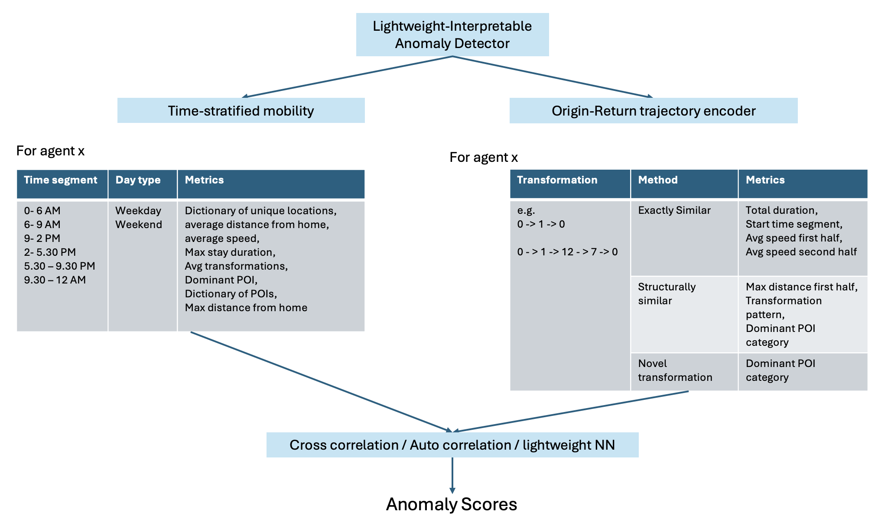

# LIAD — Lightweight Interpretable Anomaly Detector

**LIAD** is a trajectory-based anomaly detection framework for large-scale human mobility data.  
It is designed to be **interpretable, scalable, and data-efficient**.

⚠️ **Status**  
The second stage of LIAD (Origin-Return Trajectory Encoder) is under active development.  
Only the **Time-Stratified Mobility (TSM)** module is currently stable.  
Check newer releases for updates.

---

## Framework Overview

LIAD consists of two conceptual layers:

1. **Time-Stratified Mobility (TSM)**  
   Models how each agent behaves across fixed daily time windows (e.g., morning, midday, evening, night), capturing deviations in movement structure, distances, speeds, and visited locations.

2. **Origin-Return Trajectory Encoder (ORTE)** *(under construction)*  
   Will model complete home-to-home mobility cycles as structured trajectories.

<p align="center">
  
</p>

---

## 1. Environment Setup

We recommend using Conda or a virtual environment.

```bash
conda create -n liad python=3.10
conda activate liad
pip install -r requirements.txt
```

---

## 2. Data Format

### Input Files

Place the following two files in the `processed/` directory:

```bash
processed/train.csv
processed/test.csv

```

Each file must contain the following columns:

| Column | Description |
|--------|-------------|
| `agent` | Unique identifier of the agent |
| `started_at` | Start timestamp of the staypoint (UTC) |
| `finished_at` | End timestamp of the staypoint (UTC) |
| `location_id` | Unique identifier of the location |
| `latitude` | Latitude of the location |
| `longitude` | Longitude of the location |
| `poi_category` | POI category of the location |

> **Important**  
> LIAD assumes all timestamps are in **UTC**. They are internally converted to **Asia/Tokyo** during preprocessing.

---

### Ground Truth (for Evaluation)

For evaluation, place the following file in the `processed/` directory:

```bash
processed/anomalous_agents.csv

```

This file must contain a single column:

| Column | Description |
|--------|-------------|
| `agent` | IDs of all anomalous agents |

This file is used only for computing evaluation metrics such as Precision–Recall and AUC.

---

## 3. Time-Stratified Mobility (TSM) Data Processing

Navigate to: data_processing/


Make the pipeline executable:

```bash
chmod +x run_tsm_pipeline.sh
```
Run the pipeline

```bash
./run_tsm_pipeline.sh

```

This script performs the following:

    Processes TRAIN and TEST datasets sequentially

    Builds per-agent monthly and weekly time-stratified summaries

    Logs all output to processed/logs/

The following files will be generated:

```bash
processed/train_monthly.csv
processed/test_monthly.csv
processed/train_weekly.csv
processed/test_weekly.csv

```
These summary files are the inputs to the anomaly detection module.

### Timezone Warning

The preprocessing pipeline assumes all timestamps are UTC and converts them to Asia/Tokyo.

If your data is already in Asia/Tokyo, open: data_processing/tsm.py

Comment out:

```python
data['started_at'] = data['started_at'].dt.tz_localize('UTC').dt.tz_convert('Asia/Tokyo')
data['finished_at'] = data['finished_at'].dt.tz_localize('UTC').dt.tz_convert('Asia/Tokyo')
```
Uncomment:

```python
data['started_at'] = data['started_at'].dt.tz_localize('Asia/Tokyo')
data['finished_at'] = data['finished_at'].dt.tz_localize('Asia/Tokyo')
```

If this step is wrong, all temporal features and anomaly scores will be incorrect.

## 4. Time-Stratified Mobility Anomaly Scoring

Navigate to:

```bash
framework/tsm/
```

Run either: python tsm.py or tsm_scores.ipynb (recommended for easier analysis)

This will generate:

```bash
processed/anomaly_scores.csv
```
This file contains one or more anomaly-score columns (from different model runs), indexed by agent.

The notebook can directly use this file to compute:

    Precision–Recall curves

    AUC-PR

    Threshold-based detection performance

## Outputs

For each agent, LIAD produces:

    A continuous anomaly score

    Interpretable components capturing:

        Distance shifts

        Speed changes

        New locations

        POI changes

        Temporal structure violations

This enables not just detection, but explanation of why an agent’s behavior changed.
